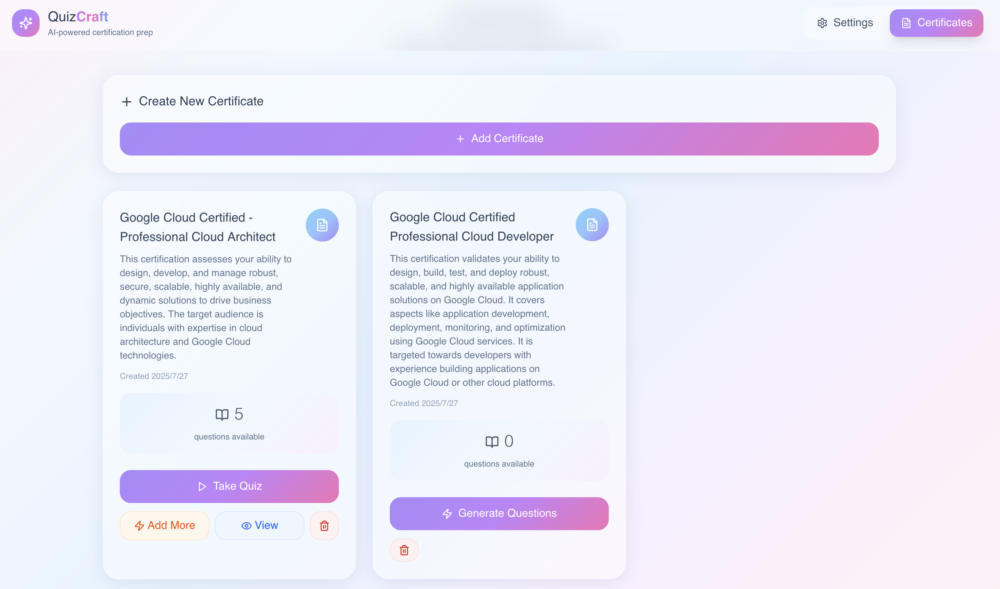
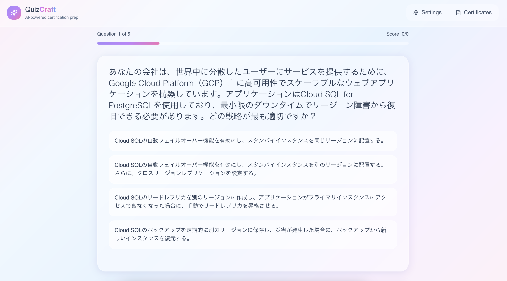

# QuizCraft - AI Certification Quiz Generator

A modern Next.js application that creates personalized certification practice quizzes using Google's Gemini AI. Features intelligent certification validation, auto-generated descriptions, real-time question generation, and a streamlined certificate-centric workflow with permanent local storage.

## ✨ Key Features

### 🤖 **AI-Powered Certification Management**
- **Smart Validation**: Real-time certification name validation with auto-correction
- **Intelligent Suggestions**: AI fixes misspellings and suggests official certification names
- **Auto-Generated Descriptions**: Comprehensive descriptions automatically created for valid certifications
- **Fallback System**: Robust validation that works even when AI responses fail

### 🔥 **Streamlined Quiz Experience**
- **Direct Access**: Take quizzes directly from certificate cards - no separate quiz management
- **Live Generation**: Questions generate in real-time as you progress through the quiz
- **Instant feedback**: Get immediate explanations after each answer
- **Progress auto-save**: Never lose your progress - every answer is automatically saved
- **Exit anytime**: Start a quiz, exit halfway, and continue later exactly where you left off

### 🎯 **Smart Question Generation**
- **Latest content**: AI generates questions based on current certification exam objectives and best practices
- **Adaptive difficulty**: Questions cover various domains and difficulty levels within each certification
- **Context-aware**: Each question builds upon the certification's specific requirements and terminology
- **Expandable Banks**: Add more questions to existing certificates to build comprehensive question libraries

### 💾 **Permanent Storage**
- **Local persistence**: All quizzes and progress stored permanently in your browser's localStorage
- **Survives refreshes**: Data persists through browser restarts, tab closures, and computer reboots
- **Privacy-first**: All data stays on your device - nothing sent to external servers
- **Smart management**: Automatic deduplication and progress tracking

### 🌍 **Multi-Language Support**
Generate quizzes in 20+ languages including:
- English, Spanish, French, German, Italian, Portuguese
- Japanese (日本語), Korean (한국어), Chinese (中文)
- Hindi (हिन्दी), Arabic (العربية), Russian (Русский)
- And 14+ more languages with native script support

### 🎨 **Beautiful Interface**
- **Minimalistic design**: Clean, distraction-free interface with pastel gradients
- **Glassmorphism effects**: Modern UI with backdrop blur and transparency
- **Full-width layout**: Browser-wide responsive design that maximizes screen real estate
- **Smooth animations**: Floating cards and seamless transitions throughout
- **Mobile-optimized**: Perfect experience on desktop, tablet, and mobile devices

### 📊 **Progress Tracking**
- **Visual indicators**: Easily identify complete vs. in-progress quizzes
- **Real-time scoring**: See your score update as you progress
- **Session history**: Browse all your quiz attempts with timestamps
- **Status badges**: Clear visual distinction between completed and ongoing sessions

## 📸 Screenshots

### Certificate Management with AI Validation

*Certificate creation with AI-powered validation, auto-generated descriptions, and smart action buttons*

### Interactive Quiz Experience

*Real-time quiz sessions with instant feedback, progress tracking, and detailed explanations*

## Getting Started

### Prerequisites

- Node.js 18+ 
- Google Gemini API key (get one from [Google AI Studio](https://makersuite.google.com/app/apikey))

### Installation

1. Install dependencies:
```bash
npm install
```

2. Start the development server:
```bash
npm run dev
```

3. Open [http://localhost:3000](http://localhost:3000) in your browser

### Building for Production

```bash
npm run build
npm start
```

## 🚀 How to Use

### 1. Setup Your Settings

1. Navigate to **"Settings"** to configure your API key
2. Enter your **Gemini API Key** (get one from [Google AI Studio](https://makersuite.google.com/app/apikey))
3. Select your **preferred language** from 20+ supported options
4. Save your settings

### 2. Create and Manage Certificates

1. Go to the **"Certificates"** tab (opens by default)
2. Click **"Add Certificate"** to create a new certification
3. Enter the certificate name (e.g., "AWS SAA", "CompTIA Sec+", "Google Cloud Architect")
4. **🤖 AI Validation**: Click the ✓ button to validate and auto-correct certification names
   - Fixes common misspellings (e.g., "Goolge Cloud" → "Google Cloud Professional Cloud Architect")
   - Suggests official certification names for abbreviations
   - Provides alternative suggestions if certification doesn't exist
5. **📝 Auto-Generated Descriptions**: Valid certifications automatically get detailed descriptions
6. Click **"Create Certificate"** to save

### 3. Certificate Cards with Smart UI

Each certificate card displays:
- **Certificate name and description** (auto-generated or custom)
- **Creation date** and **question count**
- **Smart action buttons**:
  - **"Generate Questions"** (when no questions exist)
  - **"Take Quiz"** (primary button when questions available)
  - **"Add More"** (generate additional questions)
  - **"View"** (review all questions and answers)
  - **"Delete"** (remove certificate and questions)

### 4. Generate Questions

- For new certificates: Click **"Generate Questions"**
- For existing certificates: Click **"Add More"** to expand question bank
- Choose the **number of questions** (1-20)
- Questions generate using your saved API key and language settings
- All questions are saved permanently to the certificate's question bank

### 5. Take Quiz Directly from Certificates

- Click **"Take Quiz"** on any certificate card with questions
- **Real-time quiz experience**: Answer questions with instant detailed explanations
- **Visual progress**: Track your advancement with the progress bar and question counter
- **Auto-save**: Every answer is automatically saved - never lose your progress
- **Exit flexibility**: Use "Exit Quiz" to pause and continue later
- Returns to certificates page when completed

### 6. Advanced Features

- **🤖 AI-Powered Validation**: Real-time certification name validation and correction
- **📝 Smart Descriptions**: Automatically generated certification descriptions
- **📚 Question Banks**: Build comprehensive question libraries for each certification
- **🔄 Expandable Quiz Sets**: Add more questions to existing certificates anytime
- **👁️ Question Review**: View all questions with answers and explanations before taking quizzes
- **🗑️ Easy Management**: Delete certificates and all associated questions with confirmation

### 7. Persistent Storage

- **Automatic saving**: All certificates, questions, and quiz progress save to your browser's local storage
- **Permanent data**: Data persists through browser refreshes and computer restarts
- **Privacy-focused**: All data stays on your device - nothing sent to servers
- **Organized storage**: Certificates and questions are organized for easy management

## API Key Setup

1. Visit [Google AI Studio](https://makersuite.google.com/app/apikey)
2. Sign in with your Google account
3. Create a new API key
4. Copy the key and paste it in the application

**Note**: Your API key is only used locally and is never stored or transmitted anywhere except to Google's Gemini API.

## 🤖 AI Validation Examples

The AI validation system helps ensure you create certificates with proper, standardized names:

### ✅ **Auto-Correction Examples**
- **"AWS SAA"** → **"AWS Certified Solutions Architect Associate"**
- **"CompTIA Sec+"** → **"CompTIA Security+"** 
- **"Goolge Cloud"** → **"Google Cloud Professional Cloud Architect"**
- **"Microsft Azure"** → **"Microsoft Azure Fundamentals"**

### 🔍 **Smart Suggestions**
- **"Invalid Certification"** → Suggests: ["AWS Certified Developer", "CompTIA Security+", "Google Cloud Professional Cloud Architect"]
- **"Cloud Architect"** → Suggests official cloud architect certifications from major providers

### 📝 **Auto-Generated Descriptions**
Valid certifications automatically receive detailed descriptions covering:
- What skills and knowledge areas the certification validates
- Target audience and required experience level  
- Professional value and career benefits
- Concise but comprehensive overview (2-3 sentences)

## Supported Certifications

The quiz maker can generate questions for any professional certification, including but not limited to:

- **Cloud Platforms**: AWS, Google Cloud, Microsoft Azure
- **DevOps**: Docker, Kubernetes, Jenkins, Terraform
- **Security**: CISSP, CompTIA Security+, CISM
- **Project Management**: PMP, Scrum Master, Agile
- **Database**: Oracle, MySQL, PostgreSQL, MongoDB
- **Networking**: Cisco, CompTIA Network+
- **And many more!**

## 🛠️ Technical Details

### Technology Stack

- **Framework**: Next.js 15 with App Router
- **Language**: TypeScript with strict type checking
- **Styling**: Tailwind CSS with custom gradient utilities
- **AI Integration**: Google Gemini 2.0 Flash API
- **Storage**: Browser localStorage with automatic persistence
- **Icons**: Lucide React icon library
- **Architecture**: Server-side API routes with client-side UI

### Project Structure

```
src/
├── app/
│   ├── page.tsx                    # Main application entry point
│   ├── certificates/               # Certificate management pages
│   ├── settings/                   # Settings configuration pages
│   ├── session/                    # Quiz session pages
│   └── api/
│       ├── generate-quiz/          # Legacy bulk generation API
│       └── generate-question/      # Real-time single question API
├── components/
│   ├── AppLayout.tsx              # Header navigation layout
│   ├── CertificateManager.tsx     # Certificate creation and management
│   ├── SettingsForm.tsx           # Settings configuration form
│   └── QuizSession.tsx            # Live quiz interface with real-time generation
├── lib/
│   └── storage.ts                 # localStorage persistence layer
└── types/
    └── quiz.ts                    # Comprehensive type definitions
```

### Key Innovations

- **🤖 AI-Driven Validation**: First certification app with real-time name validation and auto-correction
- **📋 Certificate-Centric Design**: Organize everything around certifications - no separate quiz management needed
- **🎯 Direct Quiz Access**: Take quizzes directly from certificate cards with smart UI that adapts to available questions
- **📚 Persistent Question Banks**: Build comprehensive, expandable question libraries for each certification
- **⚡ Real-time Generation**: Questions generate on-demand using the latest AI models
- **🛡️ Robust Fallback System**: Multiple validation layers ensure functionality even when AI responses fail
- **🔧 Clean Architecture**: Separated settings from quiz configuration for better maintainability

## 🔧 Troubleshooting

### Common Issues

1. **API Key Error**: Ensure your Gemini API key is valid and has sufficient quota
   - Get a fresh key from [Google AI Studio](https://makersuite.google.com/app/apikey)
   - Check that your API key has access to the Gemini 2.0 Flash model

2. **Question Generation Fails**: 
   - Check your internet connection stability
   - Try with a shorter certification name
   - Reduce the number of questions if experiencing timeouts

3. **Progress Not Saving**: 
   - Ensure your browser allows localStorage
   - Check that you're not in private/incognito mode
   - Clear browser cache if experiencing corruption

4. **Build Errors**: 
   - Run `npm install` to ensure all dependencies are installed
   - Use Node.js version 18 or higher
   - Clear `node_modules` and reinstall if needed

### Browser Compatibility

- **Recommended**: Chrome 90+, Firefox 90+, Safari 14+, Edge 90+
- **localStorage support**: Required for persistence features
- **ES6+ support**: Required for modern JavaScript features

### Performance Tips

- **Optimal question count**: 5-10 questions for best experience
- **Network stability**: Stable internet required for real-time generation
- **Storage cleanup**: Use browser dev tools to clear localStorage if needed

### Getting Help

If you encounter issues:

1. **Check browser console** for error messages and network issues
2. **Verify API key** is correct and has sufficient quota
3. **Test connectivity** to api.openai.com and generativelanguage.googleapis.com
4. **Try different certifications** to isolate content-specific issues
5. **Clear browser storage** if experiencing persistent errors

### Data Export/Backup

To backup your quiz data:
1. Go to "Certificates" tab
2. Use the "View" button to see questions for each certificate
3. Copy question data for manual backup if needed
4. All data is stored in browser localStorage for automatic persistence

### Privacy & Security

- ✅ All quiz data stored locally in your browser
- ✅ API key only sent to Google's Gemini API
- ✅ No personal data transmitted to third parties
- ✅ Quiz content can be exported and deleted anytime
